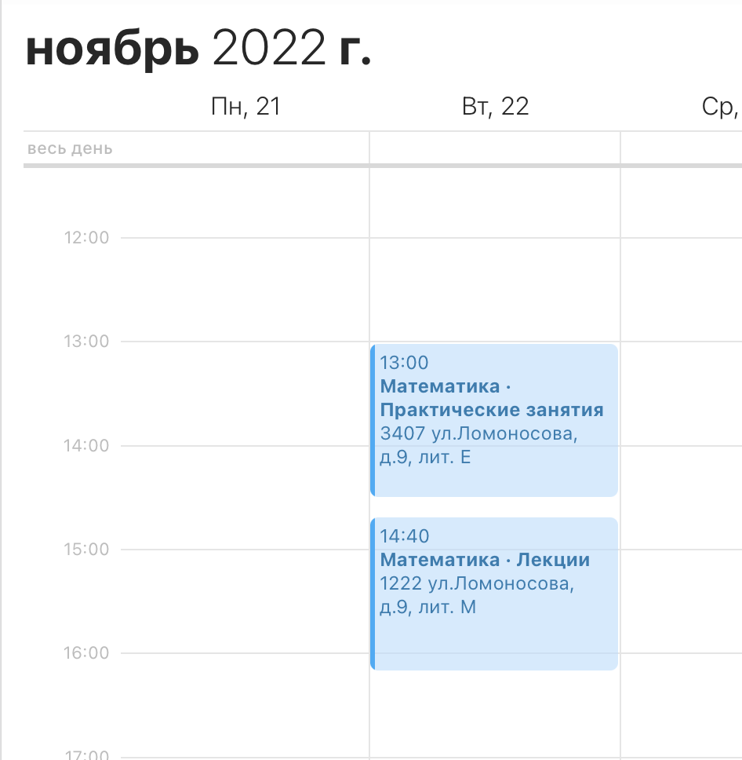

# ITMO iCal

# 😥 Больше не работает из-за недоступности сайта с расписанием

### Синхронизируй своё расписание с календарём!



## Как воспользоваться?

Добавь расписание в свой календарь по инструкции ниже. В качестве ссылки используй общедоступную версию по адресу
https://itmo-ical.deta.dev или подними свой инстанс проекта по инструкции ниже.

## Как добавить календарь в приложение?

### Android (Google Calendar)

Из самого андроид-приложения, похоже, добавить календарь нельзя. Поэтому придется зайти на https://calendar.google.com

Дальше Настройки → Добавить календарь → Добавить по URL. Дальше указать `<адрес_сервера>/<ID ИСУ>`

### macOS

В приложении Календарь меню Файл → Новая подписка на календарь...

Дальше указать `<адрес_сервера>/<ID ИСУ>`

Календарь синхронизируется между устройствами, добавлять его на iOS уже не нужно.

### iOS

Настройки → Календарь → Учетные записи → Учётные записи → Другое → Подписной календарь.
Дальше указать `<адрес_сервера>/<ID ИСУ>`

Календарь синхронизируется между устройствами, добавлять его на macOS уже не нужно.

## Запуск на Deta.sh

[](https://go.deta.dev/deploy?repo=https://github.com/Loskir/itmo-ical)

## Запуск на своём сервере

Понадобится сервер с общедоступным IP.

### Через docker-compose

```yaml
version: '3.7'
services:
  hse_ical:
    image: ghcr.io/loskir/itmo-ical:master
    restart: always
    environment:
      PORT: 3000
```

### Через docker

```shell
docker run -p 3000:3000 -e PORT=3000 -d ghcr.io/loskir/itmo-ical:master 
```

### Через node

1. Установить зависимости

`yarn` / `npm install`

2. Создать `.env` файл c конфигурацией (образец есть в `.env.example`)

3. Запустить

`yarn distribute` / `npm run distribute`

## Как это работает?

Создаётся веб-сервер, который по запросу дёргает расписание на ближайшие две недели из API sigkill.ru, 
собирает из него файл в формате [.ics](https://en.wikipedia.org/wiki/ICalendar) и отдаёт пользователю.
